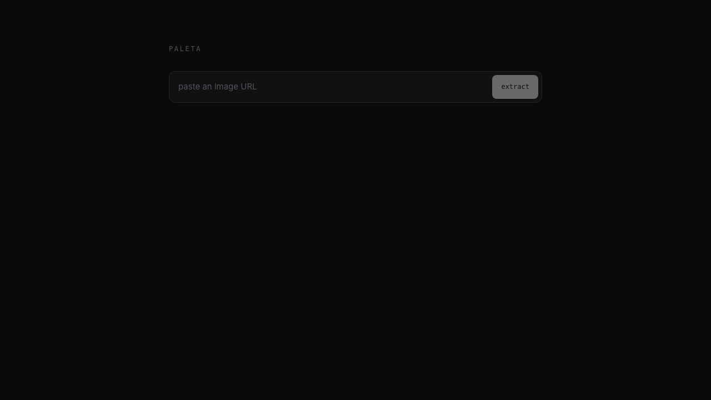
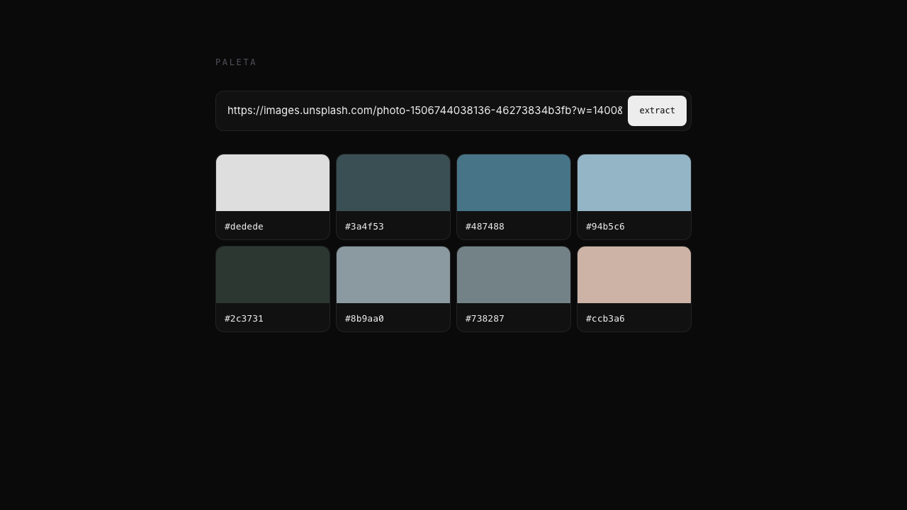

# paleta — demo starter

A deployable starter you can clone to your own Cloudflare account. One
Worker, one React SPA, one `/api/palette` endpoint. Paste an image URL,
get a palette.

[](https://deploy.workers.cloudflare.com/?url=https://github.com/Kenth06/paleta/tree/main/examples/demo)




- **Frontend:** Vite + React 19 + TypeScript + Tailwind v4 + Kumo
- **Backend:** Cloudflare Worker (serves the SPA via the `[assets]` binding
  and exposes `/api/palette?url=...`)
- **Pipeline:** `@ken0106/core` + `@ken0106/jsquash` with `useDcOnlyJpeg: true`

## Run locally

```sh
# from repo root
pnpm install
pnpm -C examples/demo dev
```

Open <http://localhost:5173>. Vite proxies `/api/*` to the wrangler dev
Worker on `:8787`, so the UI hits the real runtime.

## Deploy to your own Cloudflare account

Click the **Deploy to Cloudflare** button above, or run it yourself:

```sh
wrangler login           # first time only
pnpm -C examples/demo deploy
```

That runs `vite build` then `wrangler deploy`. The Worker + built assets
upload together. First deploy lands at
`https://paleta-demo.<your-subdomain>.workers.dev`. Rename `name` in
`wrangler.jsonc` to change the subdomain.

## Configure

Everything worth tweaking lives in `wrangler.jsonc`:

- **Worker name** — `name: "paleta-demo"`
- **Host allowlist** — add `"vars": { "ALLOWED_HOSTS": "images.unsplash.com,*.your-cdn.com" }`
  to restrict which image origins the API will fetch. Default is open so
  the demo works against any public image URL.
- **Durable Object cache** — uncomment the two blocks at the bottom of
  `wrangler.jsonc` and the `export { PaletaCacheDO }` line in
  `src/worker.ts` to enable sub-millisecond cross-colo cache hits.

## API

```
GET /api/palette?url=<image>&count=<n>&bg=<#hex>
```

Returns the paleta result with these additions:

- `palette[].oklch` — CSS `oklch(...)` string per swatch.
- `accents.onBlack` / `onWhite` — pre-computed WCAG picks for the two
  most common backgrounds, including contrast ratio and WCAG tier.
- `accents.onCustom` — same, for a `bg=` query param.
- `meta.path` — which fast path fired: `dc-only`, `cache-hit`,
  `exif-thumb`, or `full-decode`.

The UI renders only the palette swatches. Everything else is there for
you to use if you want to extend the starter.

## Architecture

```
Browser ──fetch /api/palette── Worker ──── getPalette() ─── caches.default
   │                              │                     │
   │                              ▼                     └── (opt) PaletaCacheDO
   │                    @ken0106/core pipeline
   │                    + @ken0106/jsquash decoders
   │                    + DC-only JPEG Rust WASM
   │
   └──── static SPA served by [assets] binding (no Worker invocation)
```

`run_worker_first: ["/api/*"]` keeps asset requests from invoking the
Worker at all, so your free-tier budget funds palette extraction, not
`index.html` delivery.
